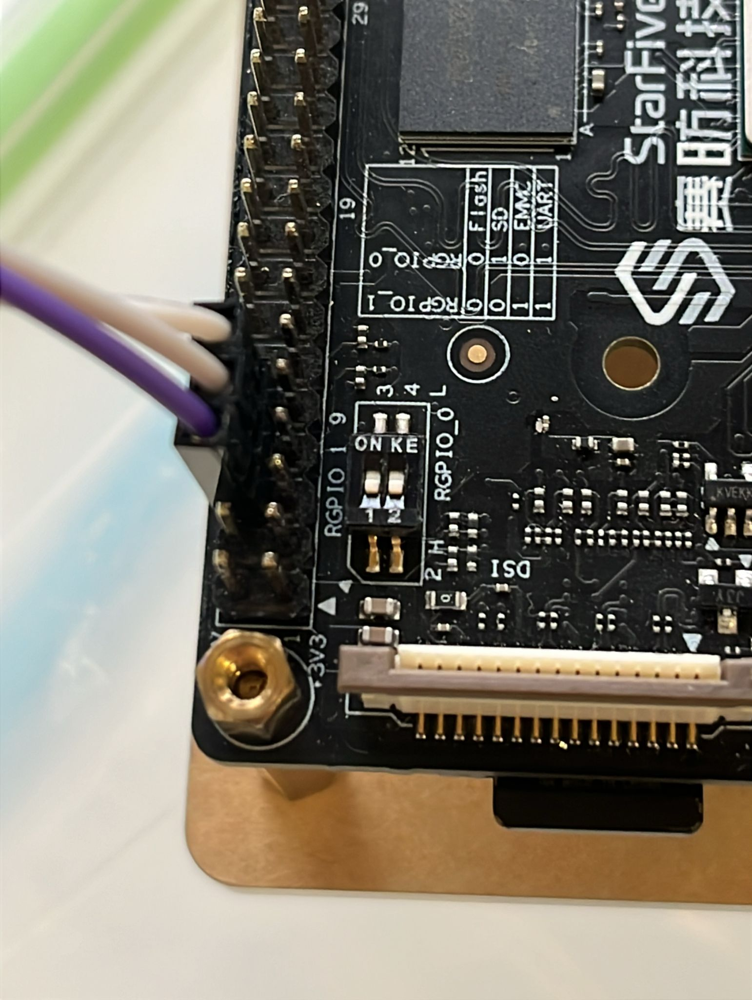
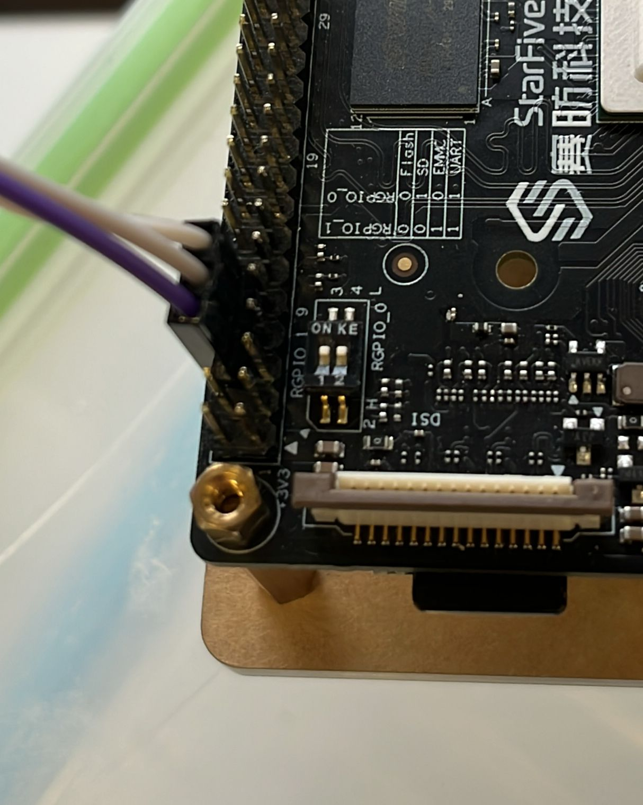

## Documentation

[Board documentation](https://doc-en.rvspace.org/VisionFive2/PDF/VisionFive2_QSG.pdf)
[Miralis repository](https://github.com/CharlyCst/miralis)

## Step 1: Build an image with Miralis

You can either compile the fast or unmodified image using make

```bash
make unmodified-image
```

or

```bash
make miralis
```

## (alternative) Step 1: Build an image with Miralis for the VisionFive 2

Use `mkikage` package ([documentation](https://linux.die.net/man/1/mkimage)).

1. You need a .its file that describe the structure of the final image, an image of miralis and whatever other firmware or binaries you want inside. 

The .its file (image source file) should describe all the loadable binaries and their load addresses. The entrypoint address should usually be specified just once.

Example of the image source file:
``` json
/dts-v1/;

/ {
        description = "U-boot-spl FIT image for JH7110 VisionFive2";
        #address-cells = <2>;

        images {
                firmware {
                        description = "miralis";
                        data = /incbin/("./target/riscv-unknown-miralis/debug/miralis.img");
                        type = "firmware";
                        os = "u-boot";
                        load = <0x0 0x43000000>;
                        entry = <0x0 0x43000000>;
                        compression = "none";
                };

                virtual-firmware {
                        description = "virtual firmware";
                        data = /incbin/("./target/riscv-unknown-firmware/debug/csr_write.img");
                        type = "firmware";
                        arch = "riscv";
                        load = <0x0 0x40000000>;
                        compression = "none";
                }; 
        };

    configurations {
        default = "config-1";

        config-1 {
            description = "U-boot-spl FIT config for JH7110 VisionFive2";
            firmware = "firmware";
            loadables = "virtual-firmware";
        };
    };
};
```

*The default RAM range for VisionFive2 is `0x40000000` to `0x43FFFFFF`, so ensure your images fit within this range.*

2. The command to build the image is: 

`mkimage -f {your_its_file}.its -A riscv -O u-boot -T firmware {your_img_name}`

Example: `mkimage -f visionfive2-fit-image.its -A riscv -O u-boot -T firmware vision.img`

## Step 2: Flash the VisionFive Debian image on the sd card:

Please follow the section 3.3.1 from this link: [Flash Debian on the Board](https://doc-en.rvspace.org/VisionFive2/PDF/VisionFive2_QSG.pdf"). In particular, you should install BalenaEtcher and use this software to format the sd card.

## Step 3: Flashing the board with the miralis image.

For small firmware or payload, the easiest way is to use the recovering bootloader technique throught uart explained in the section 4.3 of the [board documentation]((https://doc-en.rvspace.org/VisionFive2/PDF/VisionFive2_QSG.pdf)) and use our image instead of the `visionfive2_fw_payload.img`. You need the board to boot on uart mode. In other words: 


Before booting the board, set the pins in upload mode (see picture) and boot the board. When you receives the CCCCCCCCCCCCC output, upload the recovery file.

> Press `Ctrl + A`, then `Ctrl + S`, and load the file `jh7110-recovery-20230322.bin`.

You can also skip step 6 of the documentation and upload directly the miralis image by doing: 

> Press `2` to update `fw_verif/uboot` in the flash. Then, press `Ctrl + A` followed by `Ctrl + S`, and load the `visionfive2_fw_payload.img` file.


To boot after flashing, set the RGPIO pins of the board to flash mode and reset the board like on the picture (it should be the opposite of the load mode).


| Upload mode | Run mode |
|--------------|----------|
|  |  |
| Switches are near the numbers | Switches are away of the numbers |

## Troubleshooting Minicom

Make sure you have the following settings if you get a NAK on sector

```
F - Hardware Flow Control: Yes
G - Software Flow Control: No
```


## Troubleshooting on Mac OS

On Mac OS the XMODEM tools are not installed by default (and they do not come with `minicom` either). To get `minicom` working first install [`lsx`](https://formulae.brew.sh/formula/lrzsz#default).
Then in `minicom` change the XMODEM program to `lsx -vv`.
